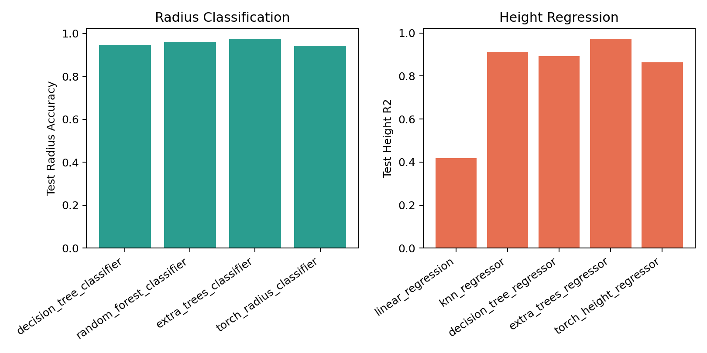
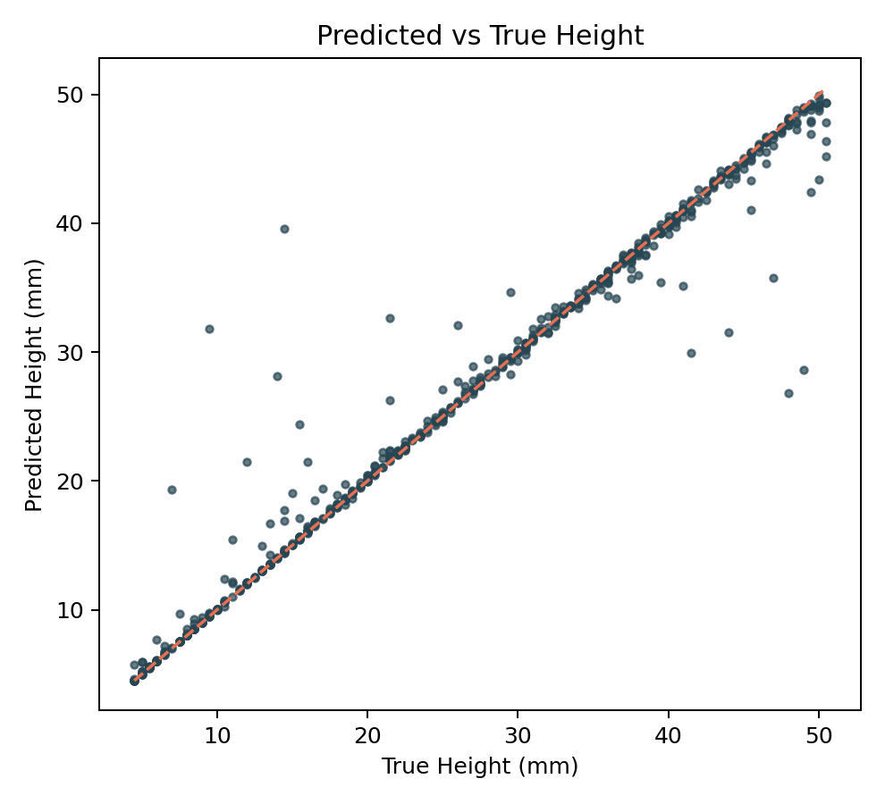
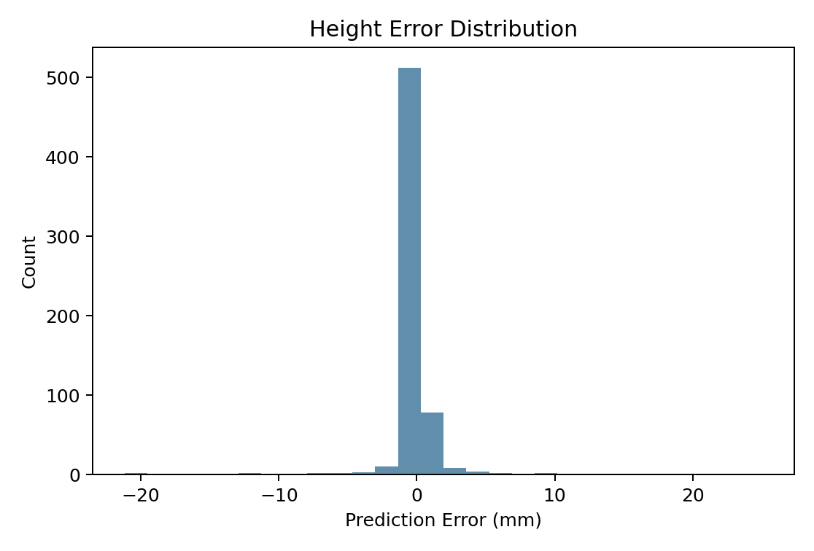
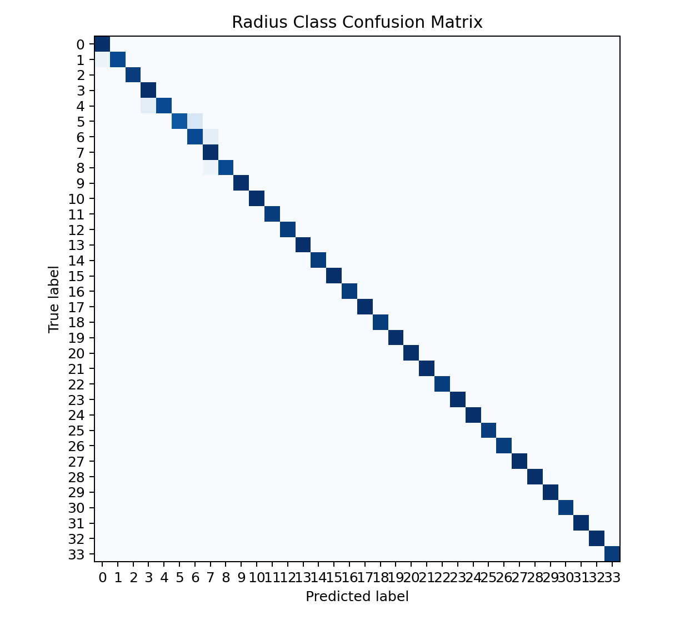

# Cavity Optimisation with Machine Learning

A privacy-safe, reproducible ML pipeline for predicting cylindrical cavity dimensions from electromagnetic responses.

## Why This Project Matters

Cavity filters are still commonly tuned with expert, manual workflows. That process is expensive, hard to scale, and difficult to reproduce consistently in manufacturing contexts. This project frames part of the tuning problem as a supervised inverse-mapping task:

- Input: `Electric_Abs_3D`, `Magnetic_Abs_3D`, `Mode 1`
- Output: cavity `cR` (radius) and `cH` (height)

The repository is packaged for public engineering review:

- no private dataset in git,
- deterministic data reconstruction,
- reproducible training/evaluation CLI,
- benchmark tables + visualized results,
- CI + secret scanning workflows.

## What Was Built

1. Deterministic data pipeline (`prepare-data`, `validate-data`) with split persistence.
2. Multiple model families:
   - legacy baselines (DT/RF/KNN/Linear + NN baselines),
   - modern tree ensemble design (`MultiOutput Extra Trees`).
3. Automatic design selection between:
   - `two_task`: radius classification + height regression,
   - `multioutput`: unified joint prediction.
4. Flask serving endpoints:
   - `GET /health`
   - `POST /predict`
   - `GET /` demo page.

## Uniqueness and Improvements

Compared with prior student-style implementations, this repository adds:

- reproducibility by construction (reconstruction script + checksums + deterministic splits),
- public-release hygiene (privacy cleanup, no private docs/data/models tracked),
- model selection and benchmark packaging suitable for PR/CI review,
- explicit comparability notes vs RL-based cavity tuning literature.

## Data Access (Public Reconstruction)

This repo does **not** include private/original raw data files.

Reconstruct compatible synthetic public-source inputs:

```bash
python scripts/reconstruct_data.py --config configs/default.yaml --profile full
```

Validate data files and schema:

```bash
python -m cavity_ml validate-data --config configs/default.yaml
```

Reconstruction references and formula basis are documented in [data/README.md](data/README.md) and cited in References ([1], [2]).

## Reproducibility

### Environment

```bash
conda env update -n dl -f environment.yml
conda run -n dl pip install -e .
```

### End-to-end run

```bash
python scripts/reconstruct_data.py --config configs/default.yaml --profile full
python -m cavity_ml prepare-data --config configs/default.yaml
python -m cavity_ml train --config configs/default.yaml
python -m cavity_ml evaluate --config configs/default.yaml
python scripts/build_readme_assets.py --config configs/default.yaml
```

### One-command workflow (with auto reconstruction)

```bash
python scripts/run_balanced_experiments.py --config configs/default.yaml --reconstruct-if-missing --profile full
```

## Results and Benchmarks

### Internal benchmark (test split)

Source: [results/benchmark/benchmark_table.csv](results/benchmark/benchmark_table.csv)

| Method | Design | Task | Radius Acc. | Radius ±1 | Height R2 | Height MAE (mm) | Train Seconds |
|---|---|---|---:|---:|---:|---:|---:|
| `decision_tree_classifier` | two_task | radius | 0.9463 | 0.9968 | - | - | 0.0044 |
| `random_forest_classifier` | two_task | radius | 0.9605 | 1.0000 | - | - | 0.2437 |
| `extra_trees_classifier` | two_task | radius | 0.9747 | 1.0000 | - | - | 0.2701 |
| `torch_radius_classifier` | two_task | radius | 0.9431 | 0.9984 | - | - | 8.2864 |
| `linear_regression` | two_task | height | - | - | 0.4185 | 8.3829 | 0.0098 |
| `knn_regressor` | two_task | height | - | - | 0.9125 | 1.5459 | 0.0016 |
| `decision_tree_regressor` | two_task | height | - | - | 0.8917 | 1.5300 | 0.0039 |
| `extra_trees_regressor` | two_task | height | - | - | 0.9720 | 0.6949 | 0.2276 |
| `torch_height_regressor` | two_task | height | - | - | 0.8642 | 2.6476 | 10.0961 |
| `multioutput_extra_trees` | multioutput | joint | 0.9889 | 1.0000 | 0.9723 | 0.6887 | 0.4994 |

The current best submission model is `multioutput_extra_trees`, which exceeds the configured legacy acceptance targets (`radius_accuracy >= 0.863`, `height_r2 >= 0.857`) on the deterministic test split.

### External SOTA / Prior Work Comparison

Source: [results/benchmark/sota_comparison.csv](results/benchmark/sota_comparison.csv)

| Citation | Approach | Reported outcome | Directly comparable to cR/cH metrics? |
|---|---|---|---|
| [3] | DDPG-based cavity tuning | Most test episodes tuned in <=20 steps | No |
| [4] | Model-based RL cavity tuning | 4x/10x lower sample complexity vs DDPG/DIRT | No |
| [5] | RL + reward shaping | Autonomous tuning demonstrated | No |
| [6] | Early RL for cavity tuning | Learns human tuning behavior | No |
| [7] | RL with imitation | Imitation-enhanced policy learning | No |

Note: external papers focus on sequential policy tuning and do not report the exact `cR` classification + `cH` regression metrics used in this repository.

## Visualized Results

### Model comparison



### Predicted vs true height



### Height error distribution



### Radius confusion matrix



## How to Read and Reuse These Results

### What the benchmark table means

- `radius_accuracy` is exact class-match performance for `cR` bins (0.5 mm step).
- `radius_within_1` is tolerance-aware accuracy (prediction within ±1 class), useful for practical tuning where near-miss values can still be actionable.
- `height_r2` and `height_mae_mm` quantify regression quality for `cH`; higher `R2` and lower `MAE` are better.
- `train_seconds` highlights computational cost for local reproducibility and method selection.

### What each figure means

- `model_compare.png`: fast model family comparison; helps choose accuracy-runtime tradeoffs.
- `pred_vs_true.png`: how close height predictions are to ideal `y=x`; spread indicates bias/variance behavior.
- `error_hist.png`: error concentration and tails; useful for tolerance analysis and risk assessment.
- `confusion_matrix_radius.png`: which radius classes are frequently confused; helps guide feature engineering or class regrouping.

### How others can reuse these artifacts

1. **Method benchmarking**: use `results/benchmark/benchmark_table.csv` as a baseline registry when adding new models.
2. **Model selection policy**: combine metric columns with runtime to define deployment thresholds.
3. **Error diagnostics**: use the same plotting script to compare failure modes across datasets/seeds.
4. **Reproducibility reporting**: regenerate tables/figures in CI or release workflows for transparent model updates.

Generate/re-generate assets with:

```bash
python scripts/build_readme_assets.py --config configs/default.yaml
```

## Public API Contracts

### CLI commands

- `prepare-data`
- `validate-data`
- `train`
- `evaluate`
- `predict`
- `serve`

### Prediction JSON contract

Input:

```json
{
  "electric_abs_3d": 1.01,
  "magnetic_abs_3d": 0.99,
  "mode_1": 12.34
}
```

Output:

```json
{
  "predicted_radius_mm": 8.5,
  "predicted_height_mm": 23.0,
  "model_name": "torch_radius_classifier+torch_height_regressor",
  "model_version": "v1"
}
```

## Limitations

- Public reconstruction is synthetic and equation-based; it is not a measured production dataset.
- External literature comparisons are mostly task-adjacent (RL tuning policy), not metric-identical.
- Results depend on reconstruction profile (`full` vs `toy`) and seed.

## Ethics and Scope

- No personal identity information is intentionally included.
- No private archived documents are included.
- No secret keys/tokens are stored in git.

## Citation and License

- Citation metadata: [CITATION.cff](CITATION.cff)
- License: [LICENSE](LICENSE)

## References (IEEE style)

[1] COMSOL AB, "Cavity Resonators," *COMSOL Multiphysics Application Library*. [Online]. Available: https://doc.comsol.com/6.1/doc/com.comsol.help.models.rf.cavity_resonators/cavity_resonators.html

[2] LearnEMC, "Resonant Frequency of Rectangular and Cylindrical Cavities." [Online]. Available: https://learnemc.com/ext/calculators/cavity_resonance/cyl-res.html

[3] Y. Wang and Y. Ou, "A DDPG-Based Method for Tuning Cavity Filter Automatically," *Applied Sciences*, vol. 12, no. 20, p. 10498, 2022, doi: 10.3390/app122010498.

[4] F. Nimara, Y. Lan, and B. Lennartson, "Model-Based Reinforcement Learning for Cavity Filter Tuning," in *Proc. CoRL*, PMLR 229, 2023. [Online]. Available: https://proceedings.mlr.press/v229/nimara23a.html

[5] Y. Wang, Y. Lan, and C. Holmberg, "Continuous reinforcement learning with knowledge-inspired reward shaping for autonomous cavity filter tuning," in *2018 IEEE Int. Conf. on Cyborg and Bionic Systems (CBS)*, 2018, doi: 10.1109/CBS.2018.8612197.

[6] Y. Wang, Y. Lan, and C. Holmberg, "Reinforcement learning approach to learning human experience in tuning cavity filters," in *2015 IEEE Int. Conf. on Robotics and Biomimetics (ROBIO)*, 2015, doi: 10.1109/ROBIO.2015.7419091.

[7] J. Lindstahl and Y. Lan, "Reinforcement Learning with Imitation for Cavity Filter Tuning," in *2020 IEEE/ASME Int. Conf. on Advanced Intelligent Mechatronics (AIM)*, 2020, doi: 10.1109/AIM43001.2020.9158839.
